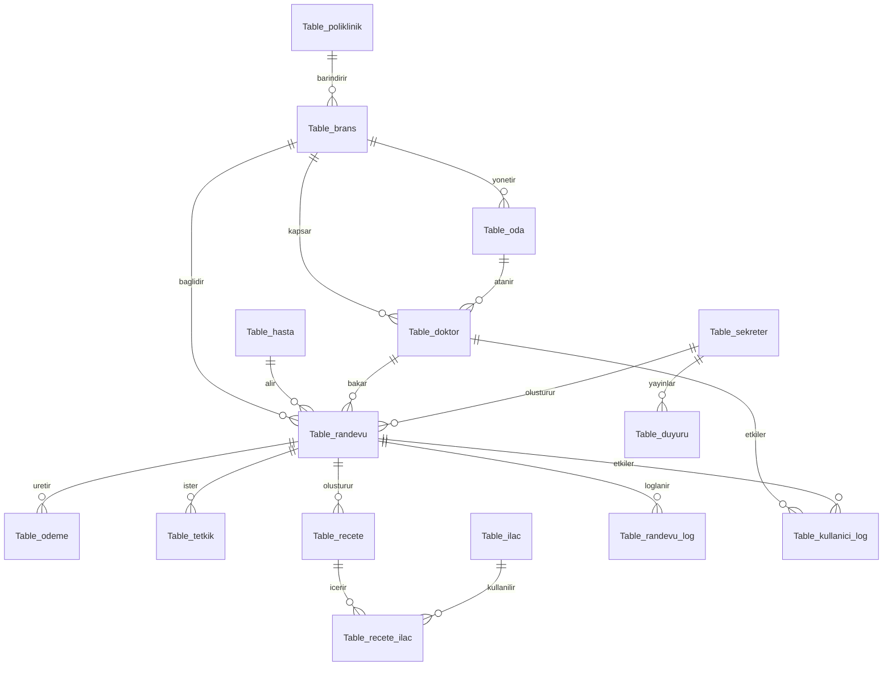

# VERITABANI SEMASI VE SUNUM OZETI

## Iliski Ozeti
Asagidaki yapi, sunumda gosterebilecegin iliskili tablo omurgasini ozetler:

## Sunumda Gosterilecek Teknik Noktalar
1. `Table_randevu`, `Table_hasta`, `Table_doktor`, `Table_brans` temel akisin omurgasini olusturur.
2. `Table_poliklinik` ve `Table_oda`, doktor ve brans yapisini daha gercekci hale getirir.
3. `Table_odeme`, `Table_tetkik`, `Table_recete`, `Table_ilac`, `Table_recete_ilac` hastane senaryosunu zenginlestirir.
4. `Table_kullanici_log` ve `Table_randevu_log`, trigger ve log tablosu beklentisini karsilar.
5. `vw_RandevuSunum` ve `vw_YonetimOzeti`, view kullanimini dogrudan ekranda gosterir.
6. `sp_RandevuOlustur` ve `sp_HastaRandevuAl`, transaction kullanan ornek prosedurlardir.
7. `fn_HastaRandevuSayisi` ve `fn_DoktorRandevuSayisi`, function kullanimini destekler.

## Sunum Sirasi Onerisi
1. Ana giris ekranini ve roller bazli yapıyı goster.
2. Sekreter panelinde ozet kartlari, brans-doktor listeleri ve duyuru/randevu olusturma alanini acikla.
3. `Yonetim Ozeti` ekraninda view, trigger ve log tablolari kullanimini goster.
4. Doktor panelinde CRUD islemlerini uygula.
5. Hasta panelinde uygun randevu secip randevu alarak transaction senaryosunu goster.
6. En sonda [Database\hastane_donem_projesi.sql](C:\Users\enes\Desktop\ders\c#\proje_hastane\proje_hastane\Database\hastane_donem_projesi.sql) dosyasindan ileri SQL yapilarini isaret et.
